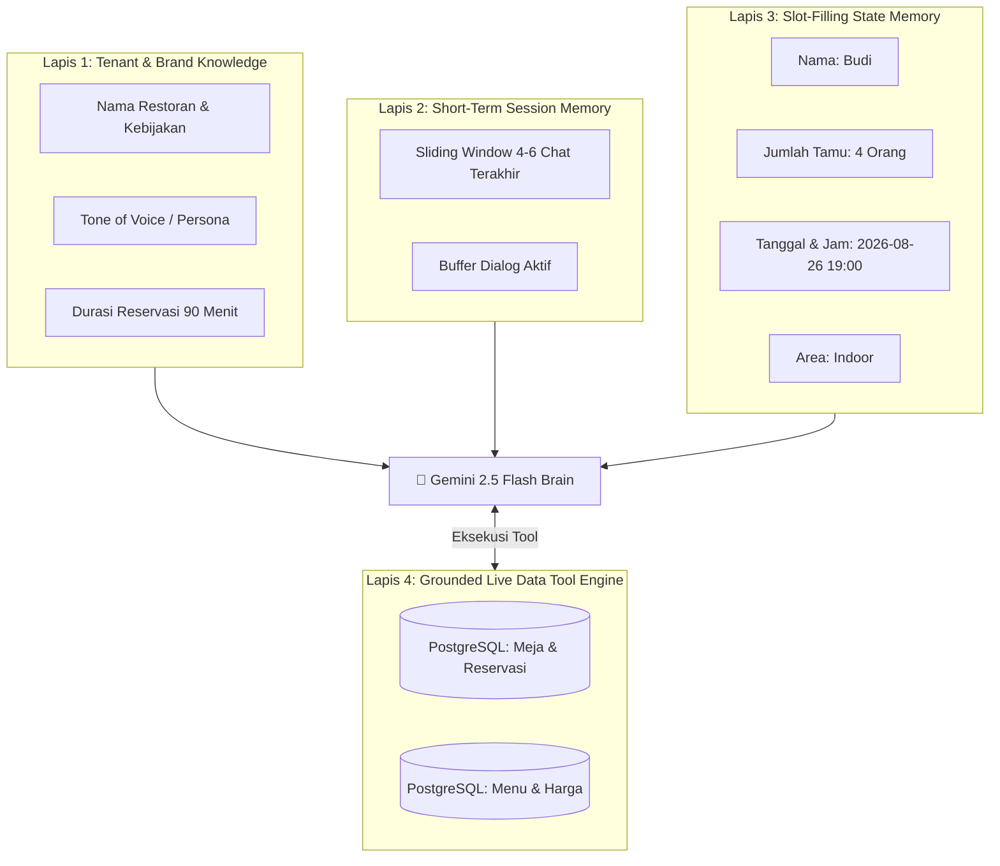
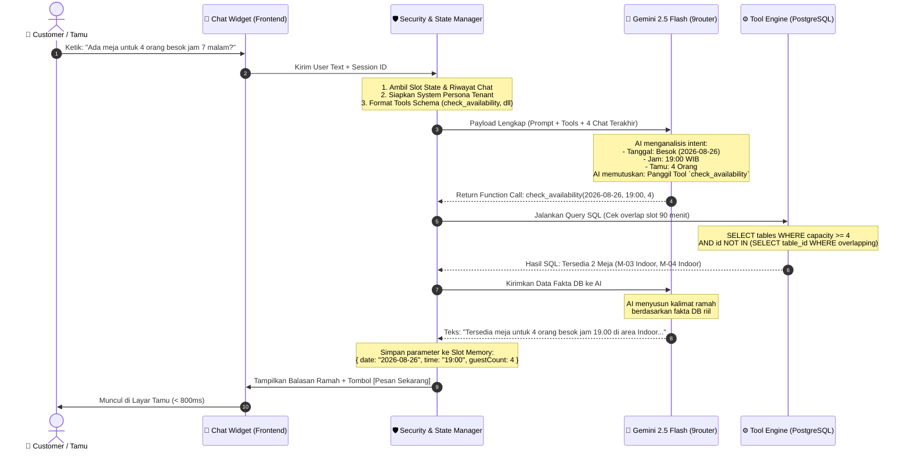

# 🧠 Arsitektur Memori, Knowledge Retrieval & Alur AI (Anti-Ngawur)

> **Dokumen Teknis & Panduan Analisis Arsitektur AI**  
> **Proyek:** Multi-Tenant AI-Powered Restaurant SaaS  
> **Target:** Akurasi 100% Data Operasional (*Zero Hallucination*), Konteks Presisi & Efisiensi Biaya  
> **Model:** Gemini 2.5 Flash via 9router + PostgreSQL Tool Engine  

---

## 📌 1. Mengapa RAG Vektor Tradisional Salah untuk Operasional Restoran?

Banyak developer pemula mengira semua AI butuh **Vector Database (Embeddings / RAG)**. Namun, untuk aplikasi restoran transaksional, pendekatan RAG Vektor murni justru menjadi penyebab utama bot menjadi **"ngawur"**.

### Perbandingan: Vector RAG vs Structured Tool Calling

```text
+--------------------------------------------------------------------------------------------------+
|                            PERBANDINGAN METODE RETRIEVAL DATA AI                                 |
+------------------------------+----------------------------------+--------------------------------+
| PARAMETER                    | TRADISIONAL VECTOR RAG           | STRUCTURED TOOL CALLING (KITA) |
+------------------------------+----------------------------------+--------------------------------+
| Tipe Pencarian               | Kemiripan Teks (Cosine Sim)      | Query SQL Presisi (PostgreSQL) |
| Cek Meja Jam 19:00 Besok     | ❌ GAGAL (Vektor tidak bisa      | ✅ AKURAT 100% (Hitung overlap |
|                              | melakukan logika matematika jam) | window 90 menit di database)   |
| Update Harga Menu            | ❌ Lambat (Harus re-embed teks)  | ✅ Instan (Langsung baca DB)   |
| Mencegah Double-Booking      | ❌ Tidak Bisa                    | ✅ 100% Terkunci (Atomic Lock) |
| Kapan Digunakan?             | Teks statis (Sejarah Restoran)   | Seluruh Operasional & Booking  |
+------------------------------+----------------------------------+--------------------------------+
```

> **Prinsip Emas Kita:**  
> AI bertindak sebagai **"Otak Pemaham Bahasa & Pengambil Keputusan"**, sedangkan PostgreSQL bertindak sebagai **"Satu-Satunya Sumber Kebenaran Fakta (*Single Source of Truth*)"**. AI **tidak boleh menebak angka atau availability**, AI wajib memanggil **Tool SQL** untuk mendapatkan fakta.

---

## 🏗️ 2. Arsitektur Memori 4-Lapis (4-Tier Memory & Context)

Agar percakapan terasa natural, AI tidak lupa konteks di tengah jalan, dan tidak menanyakan hal yang sama berulang kali, kita membagi memori menjadi 4 lapisan:



### Penjelasan Setiap Lapisan:

1. **Lapis 1 — Tenant Knowledge (Statis per Restoran):**
   * Berisi profil restoran, alamat, jam operasional, dan aturan makan (misal: toleransi terlambat 15 menit, durasi makan 90 menit).
   * Disuntikkan ke dalam *System Prompt* secara dinamis sesuai `tenant_id` restoran yang sedang dibuka pengguna.

2. **Lapis 2 — Short-Term Session Memory (Sliding Window):**
   * Menyimpan riwayat obrolan dalam sesi aktif pengguna.
   * Menggunakan teknik **Sliding Window 4–6 Turn terakhir** agar riwayat lama tidak menumpuk dan tidak membengkakkan biaya token.

3. **Lapis 3 — Slot-Filling State Memory (Pengingat Parameter):**
   * Ini adalah memori terstruktur dalam format JSON state:
     ```json
     {
       "guestCount": 4,
       "date": "2026-08-26",
       "time": "19:00",
       "preferredArea": "Indoor",
       "customerName": "Budi",
       "customerPhone": "081234567890"
     }
     ```
   * **Manfaat:** Jika di awal user bilang *"Saya mau meja untuk 4 orang besok malam"*, lalu 2 chat kemudian user bilang *"Oke booking atas nama Budi"*, AI **tidak akan bertanya lagi** *"Untuk berapa orang dan jam berapa?"* karena datanya sudah tersimpan di *Slot State*.

4. **Lapis 4 — Grounded Live Data (Database Relasional):**
   * Data riil yang selalu berubah setiap detik (status meja, tiket reservasi, stok menu).
   * Hanya diakses melalui **Tools Deterministic API**.

---

## 🔄 3. Runtutan Alur Lengkap (Step-by-Step Execution Flow)

Berikut adalah perjalanan sebuah pesan dari saat diketik oleh customer hingga menghasilkan balasan yang akurat 100%:



---

## 🔍 4. Bedah Algoritma Anti-"Ngawur" (Pencegahan Halusinasi)

Bagaimana kita menjamin AI **100% tidak pernah berbohong atau mengarang data**?

```text
┌─────────────────────────────────────────────────────────────────────────────┐
│                    3 HUKUM DETERMINISTIK AI SAAS KITA                      │
├─────────────────────────────────────────────────────────────────────────────┤
│ 1. Hukum Fakta Database (Strict Tool Rule):                                 │
│    AI dilarang keras menjawab ketersediaan meja atau harga menu jika tidak   │
│    berasal dari hasil eksekusi tool di gilirannya.                          │
│                                                                             │
│ 2. Hukum Validasi Server (Server-Side Enforcement):                         │
│    AI tidak memiliki izin menulis langsung ke database. AI hanya menyusun   │
│    parameter JSON. Eksekusi database diverifikasi oleh Business Logic API.  │
│                                                                             │
│ 3. Hukum Isolasi Tenant (Cross-Tenant Shield):                              │
│    Parameter `tenant_id` tidak pernah diminta dari tebakan AI. Server yang  │
│    menyuntikkan `tenant_id` secara otomatis berdasarkan URL/toko restoran.  │
└─────────────────────────────────────────────────────────────────────────────┘
```

### Contoh Skenario: Tamu Menanyakan Menu yang Tidak Ada
* **Customer:** *"Ada menu Steak Wagyu A5 gak?"*
* **Alur Sistem:**
  1. AI memanggil tool `get_menu(search: "wagyu")`.
  2. Database PostgreSQL mengembalikan array kosong `[]`.
  3. AI membaca output database dan menjawab:  
     *"Mohon maaf, Restoran Raso Minang tidak menyediakan Steak Wagyu. Menu utama kami adalah hidangan autentik Minang seperti Rendang Daging Sapi, Ayam Pop, dan Dendeng Balado."*
* **Hasil:** AI **tidak berhalusinasi** mengarang harga Wagyu karena AI terikat pada hasil data tool.

---

## 📊 5. Spesifikasi Payload JSON Nyata

Berikut contoh struktur data asli yang ditukarkan di dalam sistem:

### 1. Payload yang Dikirim ke Gemini 2.5 Flash:
```json
{
  "model": "google/gemini-2.5-flash",
  "temperature": 0.1,
  "max_tokens": 300,
  "messages": [
    {
      "role": "system",
      "content": "Anda adalah asisten virtual resmi Raso Minang (tenant_id: raso-minang-padang-01). Nada bicara: Ramah, santun, khas Minang modern. Dilarang mengarang menu atau ketersediaan meja. Selalu gunakan tools."
    },
    {
      "role": "user",
      "content": "Ada meja untuk 4 orang besok jam 7 malam?"
    }
  ],
  "tools": [
    {
      "type": "function",
      "function": {
        "name": "check_availability",
        "description": "Mengecek ketersediaan meja kosong berdasarkan tanggal, jam, dan jumlah tamu",
        "parameters": {
          "type": "object",
          "properties": {
            "date": { "type": "string", "description": "Format YYYY-MM-DD" },
            "time": { "type": "string", "description": "Format HH:mm" },
            "guestCount": { "type": "number", "description": "Jumlah tamu" },
            "preferredArea": { "type": "string", "enum": ["Indoor", "Outdoor", "VIP"] }
          },
          "required": ["date", "time", "guestCount"]
        }
      }
    }
  ]
}
```

### 2. Respon Structured Tool Call dari Gemini 2.5 Flash:
```json
{
  "tool_calls": [
    {
      "id": "call_abc123",
      "type": "function",
      "function": {
        "name": "check_availability",
        "arguments": "{\"date\":\"2026-08-26\",\"time\":\"19:00\",\"guestCount\":4}"
      }
    }
  ]
}
```

### 3. Eksekusi Query di Backend PostgreSQL:
```sql
-- Algoritma Overlap Slot Window 90 Menit:
SELECT t.id, t.table_number, t.capacity, t.area
FROM tables t
WHERE t.tenant_id = 'raso-minang-padang-01'
  AND t.capacity >= 4
  AND t.status = 'available'
  AND t.id NOT IN (
      SELECT r.table_id 
      FROM reservations r
      WHERE r.tenant_id = 'raso-minang-padang-01'
        AND r.reservation_date = '2026-08-26'
        AND r.status IN ('confirmed', 'pending')
        -- Menghitung tabrakan waktu dalam rentang 90 menit
        AND (r.reservation_time, r.reservation_time + INTERVAL '90 minutes') 
            OVERLAPS (TIME '19:00:00', TIME '19:00:00' + INTERVAL '90 minutes')
  );
```

---

## 🎯 6. Rangkuman Pembelajaran untuk Analisis Anda

1. **Kenapa tidak pakai Vector RAG?**  
   Karena reservasi butuh kalkulasi waktu, ketersediaan meja, dan logika matematika relasional yang hanya bisa dilakukan oleh SQL database.
2. **Bagaimana AI mengingat konteks?**  
   Dengan kombinasi **Sliding Window (4-6 chat terakhir)** untuk teks alami + **Slot-Filling State Object** untuk data terstruktur (nama, tanggal, jumlah tamu).
3. **Bagaimana menjamin akurasi 100% (Anti-Ngawur)?**  
   Dengan **Strict Tool Calling**: AI hanya membaca bahasa pengguna dan memilih fungsi; semua data harga, menu, dan meja dieksekusi langsung oleh backend PostgreSQL.
4. **Biaya & Kecepatan:**  
   Karena hanya mengirim prompt ramping dan query SQL lokal, respon selesai dalam **< 800 milidetik** dengan biaya **< Rp 5 per reservasi**.
